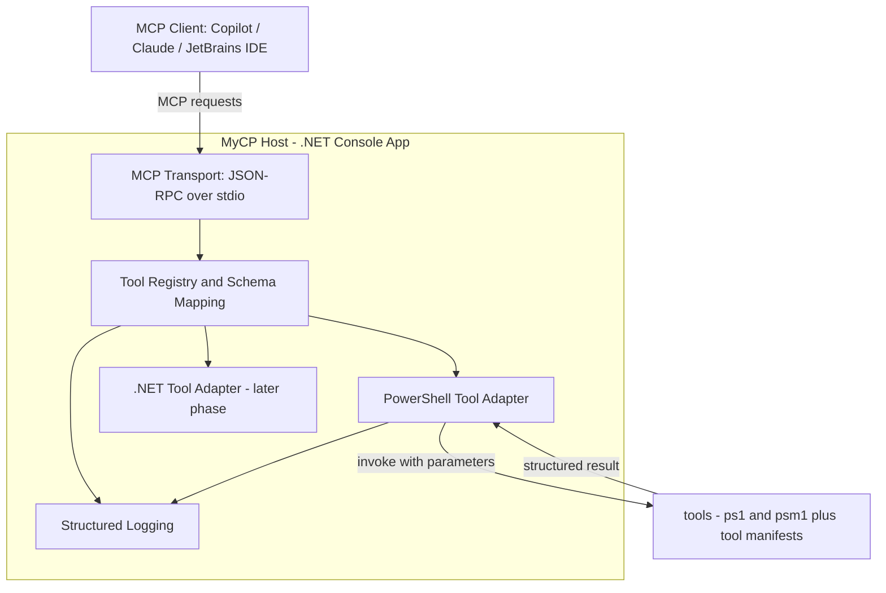

# AGENTS.md — Canonical Guidelines for AI Agents

This file is the **single source of truth** for AI coding agents (GitHub Copilot, Claude Code,
JetBrains Junie / AI Assistant) working in this repository. Assistant-specific files
(`.github/copilot-instructions.md`, `CLAUDE.md`, `.junie/guidelines.md`) only point here.

> Status: the repository is at the very beginning. Most of this document is **prescriptive**
> (the intended target design), not a description of existing code. Parts marked
> *proposed* may still change.

## Project Overview

**MyCP** is an **MCP (Model Context Protocol) service** implemented in **.NET / C#**.

The service is an **orchestrator only**. It is responsible for:

- exposing the MCP interface (protocol handling, handshake, capabilities),
- tool discovery and registration,
- mapping MCP tool arguments to tool parameters and results back to MCP responses,
- error handling and structured logging,
- process/runspace lifecycle management.

The actual functionality — the **MCP tools** — lives **outside** the host, primarily as
**PowerShell scripts/modules**, later optionally as .NET modules.

## Roadmap / Phases

| Phase | Content | Status |
|-------|---------|--------|
| 1 | Console host started and monitored from the **command line**; MCP over stdio; structured logging; **PowerShell tools** plugged in | current focus |
| 2 | Same host wrapped as a **Windows Service** (`Microsoft.Extensions.Hosting.WindowsServices`) | later |
| 3 | Additional **.NET tool modules** (assembly-based adapters, plugin loading) | later |

Do not implement Phase 2 or 3 features unless explicitly requested.

## Tech Stack

- **.NET 8** (LTS), **C#** with file-scoped namespaces, nullable reference types enabled.
- `Microsoft.Extensions.Hosting` — generic host, DI, configuration, graceful shutdown.
- `Microsoft.Extensions.Logging` — logging abstraction (Serilog as optional sink, *proposed*).
- `System.Management.Automation` (PowerShell SDK) — hosting PowerShell runspaces in-process.
- Official **MCP C# SDK** (`ModelContextProtocol`) or plain JSON-RPC 2.0 over stdio.
- `System.Text.Json` for all JSON handling (no Newtonsoft.Json).
- **PowerShell 7+** for tools.

Any new dependency must be added to this list in the same change.

## Architecture



Component responsibilities:

- **Transport** — reads/writes JSON-RPC messages on stdin/stdout. Nothing else may touch stdout.
- **Tool Registry** — scans `tools/`, reads manifests, builds JSON input schemas, resolves calls.
- **PowerShell Tool Adapter** — owns runspaces (pooled), binds parameters, converts PowerShell
  output to structured results, maps `Write-Error`/exceptions to MCP errors, forwards
  `Write-Verbose`/`Write-Information` streams to the logger.
- **Logging** — `ILogger<T>` everywhere; sinks: stderr and/or rolling file.

## Repository Layout (prescribed)

```
.
├── AGENTS.md                       # this file — canonical agent guidelines
├── CLAUDE.md                       # pointer for Claude Code
├── README.md                       # human-facing overview
├── .editorconfig                   # formatting / style authority
├── .github/copilot-instructions.md # pointer for GitHub Copilot
├── .junie/guidelines.md            # pointer for JetBrains Junie
├── MyCP.sln
├── src/
│   ├── MyCP.Host/                  # console host: DI, config, transport wiring, logging
│   ├── MyCP.Core/                  # abstractions: IMcpTool, ToolResult, registry, contracts
│   └── MyCP.PowerShell/            # PowerShell runspace adapter + manifest loading
├── tools/                          # PowerShell tools, one folder per tool
│   └── <tool-name>/
│       ├── tool.json               # manifest
│       └── <EntryPoint>.ps1
└── tests/
    ├── MyCP.Core.Tests/
    └── MyCP.PowerShell.Tests/
```

Keep new code in the project that matches its responsibility; do not create additional
top-level folders without noting them here.

## Coding Conventions

- **English is the project language.** All documentation, code comments, commit messages,
  identifiers and log messages are written in **English**.
- **`.editorconfig` is the single authority** for formatting, C# style and naming.
  Never restate, duplicate or override its rules — and never disable them locally.
- Async-first: `async`/`await`, `CancellationToken` on every I/O-bound API, no `.Result`/`.Wait()`.
- Dependency injection via **constructor injection**; register services in `MyCP.Host`.
- Logging exclusively through `ILogger<T>` with message templates
  (`_logger.LogInformation("Invoking tool {ToolName}", name)`) — never string interpolation.
- **Never** use `Console.WriteLine` / `Write-Host`: stdout is the MCP transport channel.
  Diagnostics go to the logger (stderr / file).
- Options via `IOptions<T>` bound from `appsettings.json` + environment variables.
- Errors: throw typed exceptions in `MyCP.Core`; the transport layer converts them into
  MCP error responses. Never let an exception kill the host.
- XML doc comments on public abstractions in `MyCP.Core`; otherwise comment sparingly and in English.
- Tests: xUnit + `FluentAssertions` (*proposed*), `<Name>_<Scenario>_<Expectation>` naming.

## Tool Contract

Target abstraction in `MyCP.Core`:

```csharp
public interface IMcpTool
{
    string Name { get; }
    string Description { get; }
    JsonElement InputSchema { get; }
    Task<ToolResult> InvokeAsync(JsonElement arguments, CancellationToken ct);
}
```

### PowerShell Tool Contract

Each tool is a folder under `tools/` containing a manifest `tool.json` and the entry point:

```json
{
  "name": "get-service-status",
  "description": "Returns the status of a Windows service",
  "entryPoint": "Get-ServiceStatus.ps1",
  "parameters": [
    { "name": "ServiceName", "type": "string", "required": true, "description": "Service name" }
  ]
}
```

Rules for PowerShell tools:

- `name` is lowercase kebab-case and unique; it is the MCP tool name.
- Every manifest parameter must exist as a matching `param()` entry in the entry point script,
  with the same name and a compatible .NET type. **Manifest and script must always be in sync.**
- Use `[CmdletBinding()]` and typed, `[Parameter(Mandatory = ...)]`-annotated parameters.
- Return **structured objects** (`[pscustomobject]`) via the success stream — one logical result.
  The adapter serializes them to JSON. No formatted/plain-text output, no `Write-Host`.
- Failures: `throw` or `Write-Error` — the adapter turns them into MCP errors.
- Progress/diagnostics: `Write-Verbose` / `Write-Information` only; these are forwarded to the logger.
- Tools must be side-effect-explicit, idempotent where possible, and must not prompt for input.

## Build / Run / Test Commands

Run from the repository root (PowerShell, Windows):

```powershell
dotnet restore
dotnet build
dotnet run --project src/MyCP.Host        # Phase 1: start the MCP server on stdio
dotnet test
dotnet format                              # applies .editorconfig
```

Until the solution exists, these commands are the target contract — create projects at the
prescribed paths so that they work unchanged.

## Rules for AI Agents

Do:

- Read this file first; treat it as authoritative over any assistant-specific file.
- Keep business logic **in PowerShell tools**; the host stays generic.
- Keep `tool.json` manifests and script parameters in sync in the same change.
- Use `ILogger<T>` and stderr/file sinks for all diagnostics.
- Follow `.editorconfig`; run `dotnet build` and `dotnet test` before reporting done.
- Update this file when architecture, layout, dependencies or commands change.
- Prefer small, focused changes; keep the prescribed folder layout.

Don't:

- Don't write anything to **stdout** other than MCP protocol messages.
- Don't add tool-specific business logic, hardcoded tool names or special cases to the host.
- Don't add NuGet/PowerShell dependencies without documenting them here.
- Don't implement Phase 2 (Windows Service) or Phase 3 (.NET tool modules) prematurely.
- Don't introduce a second JSON library, a second logging abstraction, or a second config source.
- Don't duplicate normative guidelines into `CLAUDE.md`, `.junie/guidelines.md` or
  `.github/copilot-instructions.md` — those stay thin pointers.
- Don't create scaffolding for CI/CD unless explicitly requested.
- Don't write documentation, comments or log messages in any language other than English.
